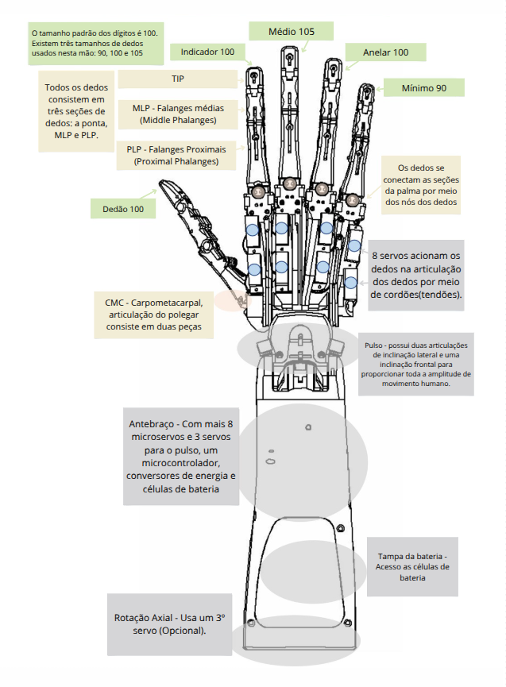

# Prótese Mioelétrica

Pesquisa de Iniciação Científica
Centro Universitário FEI

Atuando no desenvolvimento de uma prótese mioelétrica assistiva baseada na [DexHand v1.0](https://www.dexhand.org/), integrada com sensores mioelétricos para interpretar sinais musculares e reproduzir gestos da Língua Brasileira de Sinais (Libras).

🔹 **Principais atividades e tecnologias:** 

- Desenvolvimento de firmware para ESP32 e integração com sensores mioelétricos
- Implementação de algoritmos de inteligência artificial para reconhecimento de padrões musculares
- Comunicação via protocolos de IoT e redes embarcadas
- Modelagem e otimização da mecânica da prótese para maior precisão nos movimentos
- Pesquisa e validação de estratégias para acessibilidade e inclusão

O projeto busca oferecer uma solução acessível e eficiente para pessoas com deficiência auditiva e perda de membros superiores, promovendo a inclusão por meio da tecnologia.   
